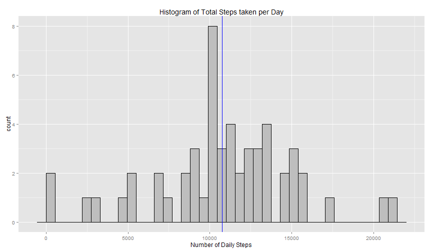
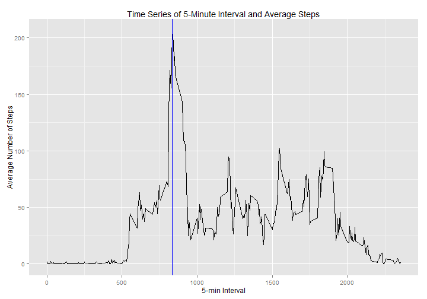
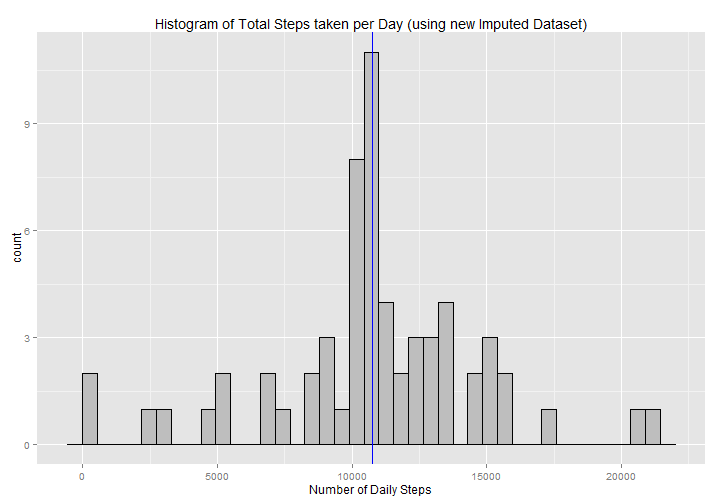
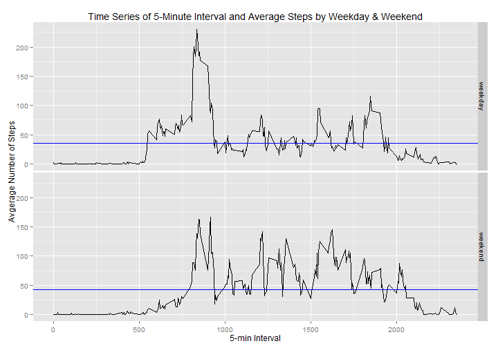

```r
library(ggplot2)
```

## Loading and preprocessing the data
Load the data from the activity.csv file.

```r
act <- read.csv( unz("activity.zip", "activity.csv") )
complete <- sum(complete.cases(act) == TRUE)    # number of obs complete (no NA's)
missing <- sum(!complete.cases(act) == TRUE)    # number of obs missing values (with NA's)
str(act)
```

```
## 'data.frame':	17568 obs. of  3 variables:
##  $ steps   : int  NA NA NA NA NA NA NA NA NA NA ...
##  $ date    : Factor w/ 61 levels "2012-10-01","2012-10-02",..: 1 1 1 1 1 1 1 1 1 1 ...
##  $ interval: int  0 5 10 15 20 25 30 35 40 45 ...
```
Total observations in the data with **completed cases** is 15264 and **missing cases** (NA) is 2304.


## What is mean total number of steps taken per day?
#### 1. Calculate the total number of steps taken per day

```r
steps.sum.date <- tapply(act$steps, act$date, sum)  # sum of steps over subsetting by each date
avg <- mean(steps.sum.date, na.rm=TRUE)             # mean total # of steps taken each day
med <- median(steps.sum.date, na.rm=TRUE)           # median total # of steps taken each day   
df <- data.frame(totalsteps=steps.sum.date, date=names(steps.sum.date))
summary(df$totalsteps)
```

```
##    Min. 1st Qu.  Median    Mean 3rd Qu.    Max.    NA's 
##      41    8841   10760   10770   13290   21190       8
```

#### 2. Make a histogram of the total number of steps taken each day

```r
g <- ggplot(data=df, aes(x=totalsteps))
g + geom_histogram(binwidth=550, col="black", fill="grey") +
    geom_vline(xintercept=avg, size=0.5, col="red") +
    geom_vline(xintercept=med, size=0.5, col="blue") +
    labs(title = "Histogram of Total Steps taken per Day",
         x = "Number of Daily Steps")
```

 

#### 3. Calculate and report the mean and median of the total number of steps taken per day

```r
avg <- round( mean(df$totalsteps, na.rm=TRUE) )
med <- median(df$totalsteps, na.rm=TRUE)
print(avg); print(med)
```

```
## [1] 10766
```

```
## [1] 10765
```
The **mean** value is $1.0766 &times; 10<sup>4</sup>$ and the **median** value is $1.0765 &times; 10<sup>4</sup>$.  
*Note: In the histogram above, the mean is denoted by the red color vertical line and the median by the blue color vertical line.*


## What is the average daily activity pattern?
#### 1. Make a time series plot of the 5-minute interval (x-axis) and the average number of steps taken, averaged across all days (y-axis)

```r
split.interval <- split(act, act$interval)                           # split data by interval
interval.avgsteps <- sapply( split.interval, 
                             function(x) mean(x$steps, na.rm=TRUE) ) # get average steps for each interval
df <- data.frame(interval=as.numeric( names(interval.avgsteps) ), 
                 avgsteps=interval.avgsteps)
idxmax <- which.max(df$avgsteps)                        # row index of df where this max exists
intervalmax <- df[idxmax, ]$interval                    # interval (x-axis) for max avg # steps
g <- ggplot(data=df, aes(x=interval, y=avgsteps))
g + geom_line() +
    geom_vline(xintercept=intervalmax, size=0.5, col="blue") +
    labs(title = "Time Series of 5-Minute Interval and Average Steps",
         x = "5-min Interval",
         y = "Average Number of Steps")
```

 

#### 2. Which 5-minute interval, on average across all the days in the dataset, contains the maximum number of steps?

```r
stepsmax <- max(df$avgsteps)                # max avg # of steps (y-axis)
idxmax <- which.max(df$avgsteps)            # row index of df where this max exists
intervalmax <- df[idxmax, ]$interval        # interval (x-axis) for max avg # of steps
print(stepsmax); print(intervalmax)
```

```
## [1] 206.1698
```

```
## [1] 835
```
The **maximum average number of steps** (y-axis) is $206$.  
The **5-min interval** (x-axis) for this maximum value is 835.  
*Note: In the time series plot above, the maximum value and interval is denoted by the blue color vertical line.*


## Imputing missing values
#### 1. Calculate and report the total number of missing values in the dataset.

```r
missing <- sum(!complete.cases(act))        # number of observations missing values (with NA's)
```
The total number of rows in **original dataset** with missing values (NAs) is 2304.

#### 2. Devise a strategy for filling in all of the missing values in the dataset.  
We will use the mean for that 5-minute interval to replace all occurances of NA in the steps variable for the same interval value. Eg if interval 2245 has 8 NA's, then we replace all 8 with the average number of steps at interval 2245.  

#### 3. Create a new dataset that is equal to the original dataset but with the missing data filled in.

```r
split.interval <- split(act, act$interval)  
for(i in 1:nrow(df)) {
    split.interval[i][[1]]$steps[is.na(split.interval[i][[1]]$steps)] <- round( df[i,]$avgsteps )
}
act.imp <- unsplit(split.interval, act$interval)    # new dataset (imputed)
missingi <- sum(!complete.cases(act.imp))         # total # of NA's in new imputed dataset (should be 0)
```
The total number of rows in **new dataset** with missing values (NAs) is 0.

#### 4. Make a histogram of the total number of steps taken each day and Calculate and report the mean and median total number of steps taken per day. 

```r
steps.sum.date.imp <- tapply(act.imp$steps, act.imp$date, sum)  # sum of steps over subsetting by each date
avgi <- mean(steps.sum.date.imp)             # mean total # of steps taken each day
medi <- median(steps.sum.date.imp)           # median total # of steps taken each day   
df.imp <- data.frame(date=names(steps.sum.date.imp), totalsteps=steps.sum.date.imp)
summary(df.imp$totalsteps)
```

```
##    Min. 1st Qu.  Median    Mean 3rd Qu.    Max. 
##      41    9819   10760   10770   12810   21190
```

```r
print(avgi); print(medi)
```

```
## [1] 10765.64
```

```
## [1] 10762
```

```r
g <- ggplot(data=df.imp, aes(x=totalsteps))
g + geom_histogram(binwidth=550, col="black", fill="grey") +
    geom_vline(xintercept=avgi, size=0.5, col="red") +
    geom_vline(xintercept=medi, size=0.5, col="blue") +
    labs(title = "Histogram of Total Steps taken per Day (using new Imputed Dataset)",
         x = "Number of Daily Steps")
```

 
The **mean** value is $1.0766 &times; 10<sup>4</sup>$ and the **median** value is $1.0762 &times; 10<sup>4</sup>$.  
*Note: In the histogram above, the mean is denoted by the red color vertical line and the median by the blue color vertical line.*  

The new values differ from the estimates from the first part of the assignment only slightly or not at all (within margin of error) as seen in these calculations:    
Difference between orginal and new **mean** value is: $1.0766 &times; 10<sup>4</sup> - 1.0766 &times; 10<sup>4</sup> = 0$.  
Difference between orginal and new **median** value is: $10765 - 1.0762 &times; 10<sup>4</sup> = 3$.  

We conclude the impact of imputing missing data on the estimates of the total daily number of steps has had little to no effect.  


## Are there differences in activity patterns between weekdays and weekends?
We use the dataset with the filled-in missing (NA) values for this part of the report.  

#### 1. Create a new factor variable in the dataset with two levels: "weekday" and "weekend".

```r
daytype <- vector()                         # vector for daytype (ie Monday thru Sunday)
for(i in 1:nrow(act.imp)) {
    if( weekdays(as.Date(act.imp[i,]$date)) %in% c("Saturday", "Sunday") ) {
        daytype[i] <- "weekend"
    }
    else {
        daytype[i] <- "weekday"
    }
}
act.imp$daytype <- as.factor(daytype)       # new factor daytype added in dataset 
str(act.imp)
```

```
## 'data.frame':	17568 obs. of  4 variables:
##  $ steps   : num  2 0 0 0 0 2 1 1 0 1 ...
##  $ date    : Factor w/ 61 levels "2012-10-01","2012-10-02",..: 1 1 1 1 1 1 1 1 1 1 ...
##  $ interval: int  0 5 10 15 20 25 30 35 40 45 ...
##  $ daytype : Factor w/ 2 levels "weekday","weekend": 1 1 1 1 1 1 1 1 1 1 ...
```

#### 2. Make a panel plot containing a time series plot of the 5-minute interval (x-axis) and the average number of steps taken, averaged across all weekday days or weekend days (y-axis).

```r
steps.aggr <- aggregate(act.imp$steps, by=list(act.imp$interval, act.imp$daytype), mean)
names(steps.aggr) <- c("interval", "daytype", "avgsteps")
avgwd <- with( subset(steps.aggr, daytype == "weekday"), mean(avgsteps) )
avgwe <- with( subset(steps.aggr, daytype == "weekend"), mean(avgsteps) )
print(avgwd); print(avgwe)
```

```
## [1] 35.60864
```

```
## [1] 42.36458
```

```r
g <- ggplot( data=steps.aggr, aes(x=interval, y=avgsteps) )
g + geom_line() +
    geom_hline(data=subset(steps.aggr, daytype == "weekday"), 
               aes(yintercept=avgwd), size=0.5, col="blue") +
    geom_hline(data=subset(steps.aggr, daytype == "weekend"), 
               aes(yintercept=avgwe), size=0.5, col="blue") +
    facet_grid(daytype ~ .) +
    labs(title = "Time Series of 5-Minute Interval and Average Steps by Weekday & Weekend",
         x = "5-min Interval",
         y = "Avgerage Number of Steps")
```

 
The **mean** average number of steps for weekdays is $36$.  
The **mean** average number of steps for weekends is $42$.  
*Note: In plot above, means are denoted respectivley by blue color horizontal lines.*    
From the plot, we can see that on weekends the avg number of steps from 10:00 to 20:00 is increases compared to that same time interval on weekdays. On weekdays, the peak in avg steps occurs in early mornings (6:00 to 9:00) and a smaller peak in late afternoon (1800 to 1900). On weekends the avg steps are more consistent between the time of usual activity.  


